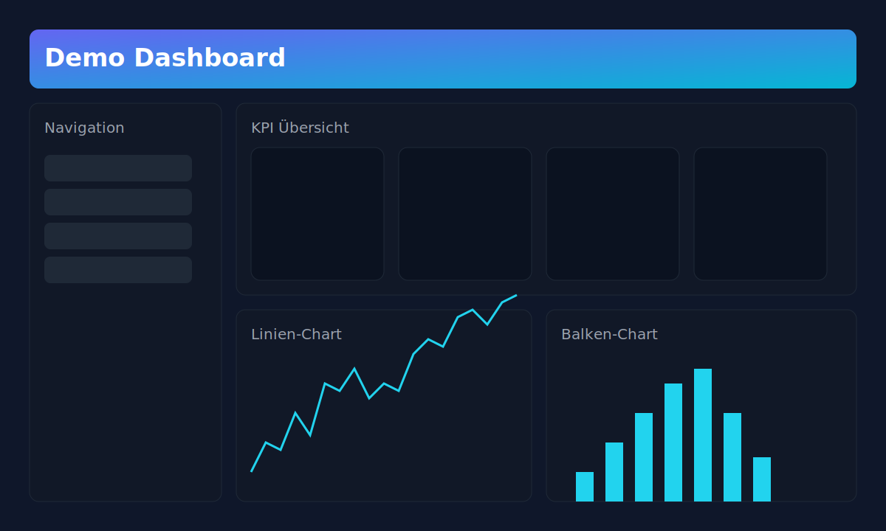
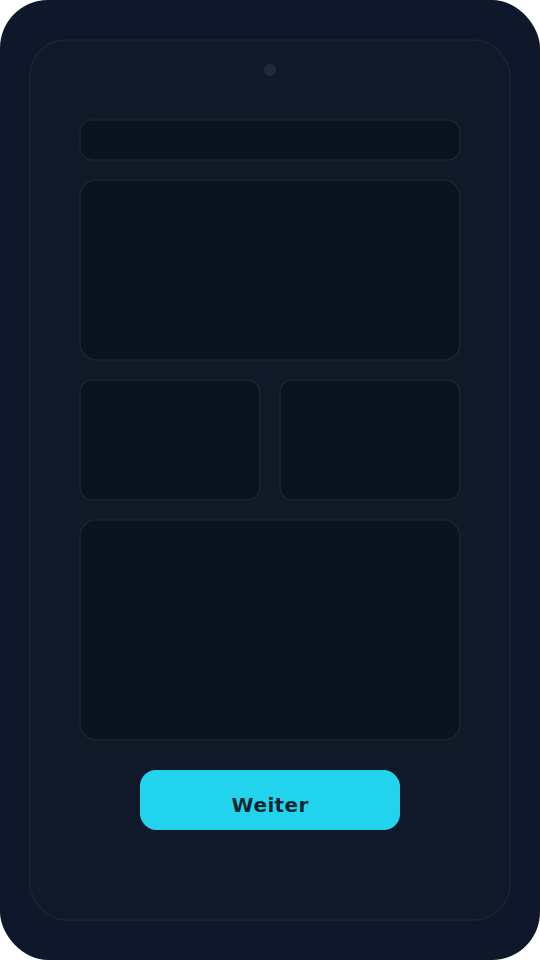
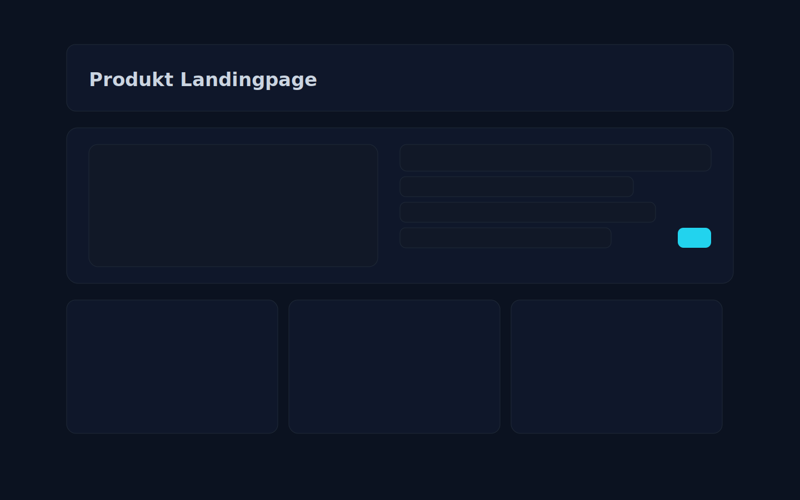

# Anleitung für eine Anwendung

Bla bla bla lorem ipsum dolor sit amet, consectetur adipiscing elit. Sed do eiusmod tempor incididunt ut labore et dolore magna aliqua.

Bla bla bla lorem ipsum dolor sit amet, consectetur adipiscing elit. Sed do eiusmod tempor incididunt ut labore et dolore magna aliqua.

Bla bla bla lorem ipsum dolor sit amet, consectetur adipiscing elit. Sed do eiusmod tempor incididunt ut labore et dolore magna aliqua.

## Mockups und Beispielinhalte

Im Folgenden finden Sie zusätzliche Mockup-Inhalte zur Veranschaulichung einer möglichen Anwendung. Diese Sektion ist rein exemplarisch und dient der Platzhalter-Dokumentation während der frühen Konzeptphase.

### Dashboard-Übersicht

Kurze Beschreibung: Ein dunkles Dashboard-Layout mit Kopfzeile, Navigation, KPI-Karten und zwei Diagrammbereichen (Linie und Balken). Ideal, um den groben Aufbau einer Admin-Oberfläche zu skizzieren.

Stichpunkte:

- Primäre Navigationsleiste links für Module/Abschnitte
- KPI-Kacheln zur schnellen Übersicht
- Kombi aus Linien- und Balkendiagramm für Trends und Verteilungen

### Mobile Ansicht

Kurze Beschreibung: Ein simples mobiles Layout mit Header, Hero-Bereich, zwei Cards, Content-Block und Call-to-Action.

Stichpunkte:

- Touch-optimierte Flächen und Buttons
- Klare Hierarchie für schnelle Orientierung
- CTA am unteren Rand für Conversion-Fokus

### Landingpage-Layout

Kurze Beschreibung: Eine Produkt-Landingpage mit Header, Hero-Sektion (Text + Visual), sowie drei Feature-Kacheln.

Stichpunkte:

- Hero-Bereich mit Value Proposition und Handlungsaufforderung
- Sekundäre Inhalte in modularen Kacheln
- Kontrastreiches Dark-Theme für moderne Optik

---

Lorem ipsum dolor sit amet, consectetur adipiscing elit. Integer non nibh ut mi tincidunt gravida. Cras fermentum, velit sed vulputate convallis, augue ante convallis est, vitae efficitur nisl nunc in odio. Curabitur at sapien id nulla aliquet ornare. Vestibulum ante ipsum primis in faucibus orci luctus et ultrices posuere cubilia curae; Mauris aliquet justo at leo placerat, in dictum risus facilisis. Nunc non rhoncus libero. Pellentesque lacinia justo vel felis blandit, eu volutpat erat bibendum. Maecenas tempor, eros et condimentum ullamcorper, nibh risus mattis nisl, ut elementum libero felis sit amet sapien. Donec sit amet pharetra magna. Etiam vel dui ut ex pharetra dictum sit amet at nulla. Integer varius, ligula ut suscipit bibendum, leo justo ullamcorper ligula, nec suscipit est odio a libero.

### Kleine Vergleichstabelle

| Variante | Zielgerät   | Schwerpunkt                |
|---------:|-------------|----------------------------|
| Dashboard| Desktop     | KPI-Übersicht & Charts     |
| Mobile   | Smartphone  | Navigation & CTA           |
| Landing  | Web         | Hero & Features            |

### Zusatzbild (PNG)

Ergänzend ein kleines PNG-Placeholder-Bild zur Vollständigkeit:

